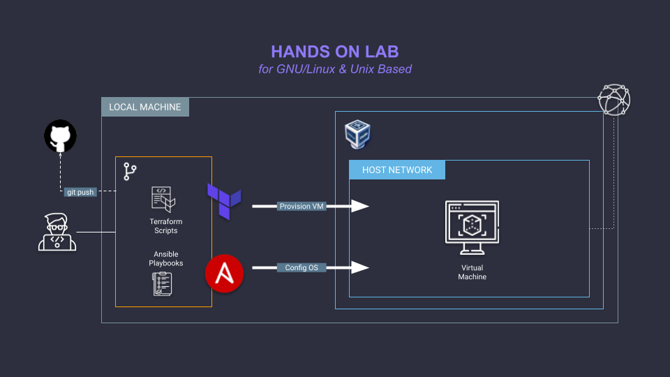
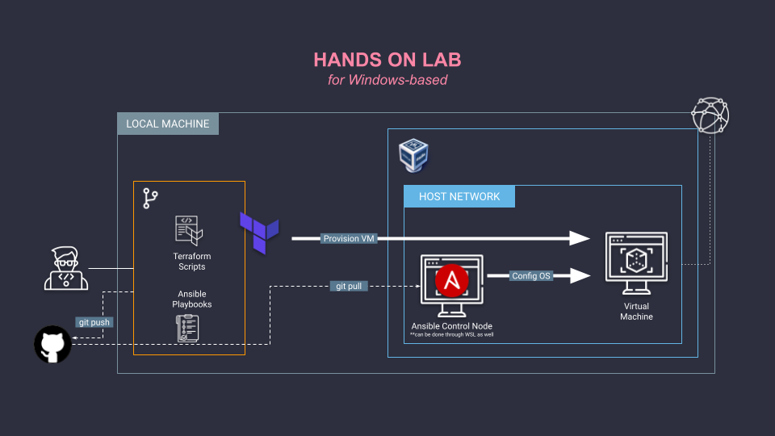

# Terraform and Ansible Demo w/ VirtualBox

## Pre-requisites
- [Terraform](https://developer.hashicorp.com/terraform/tutorials/aws-get-started/install-cli)
- [Ansible](https://docs.ansible.com/ansible/latest/installation_guide/intro_installation.html)
- [VirtualBox](https://www.virtualbox.org/wiki/Downloads)

**Notes:**
- *SSH Pass package (`sshpass`) needs to be installed on the Ansible control node if using SSH username and password in reaching managed nodes.*
- *Ansible control node requires GNU/Linux or Unix based operating system, e.g. Linux, MacOS. For Windows based machines, a virtual machine via WSL or VirtualBox VM located with the same network as managed nodes can be provisioned.*
- *Ansible Collections: Install using the following commands.*
    ```bash
    $ ansible-galaxy collection install ansible.posix
    ```
- *A VirtualBox host only network adapter must be created and identified prior to running the automation scripts.*

## Usage
1. Provisioning using **Terraform**:
    1. Create a `terraform.tfvars` file using `terraform.tfvars.sample` as the base. Modify the values accordingly.
    2. Add/Modify variables in `variables.tf` and values inside `main.tf` as intended.
    3. Initialize the Terraform providers. Run the following command:
        ```bash
        $ terraform init
        ```
    4. Inspect the resources to be provisioned. Run the following command:
        ```bash
        $ terraform plan
        ```
    5. Deploy the resources as planned. Run the following command:
        ```bash
        $ terraform apply
        ```
    6. IP address of the provisioned resource/s can be found through outputs. Run the following command.
        ```bash
        $ terraform output
        ```
2. Configuration management using **Ansible**:
    1. Load the necessary environment variables values. Refer to `.env.sample` file for values.
    2. The inventory (`inventory.ini`) can be generated from the Terraform output command. Simply automate the process by running the `tf_output_to_ansible_inventory.sh` script.
        ```bash
        $ bash tf_output_to_ansible_inventory.sh
        ```
        Or create the `inventory.ini` file manually based on the hosts and groupings from the Terraform output.
            ```ini
            [demo]
            db ansible_host=192.168.56.155
            ```
    3. Run the playbook.
        ```bash
        $ ansible-playbook playbook.yaml
        ```
3. For automated run steps found in 1 and 2, `automate.sh` can be used if the host machine is use is using GNU/Linux or Unix based operating system (Terraform and Ansible is installed in the host machine, serving as the control node).
    ```bash
    $ bash automate.sh
    ```
4. For cleanup of the environment, run the following command:
    ```bash
    $ terraform destroy
    ```

## Setup

### For GNU/Linux or Unix Based Machines


### For Windows Based Machines


### `automate.sh` Overivew


## Credits
Terraform Provider used: [Virtualbox provider by terra-farm](https://registry.terraform.io/providers/terra-farm/virtualbox/latest/docs).